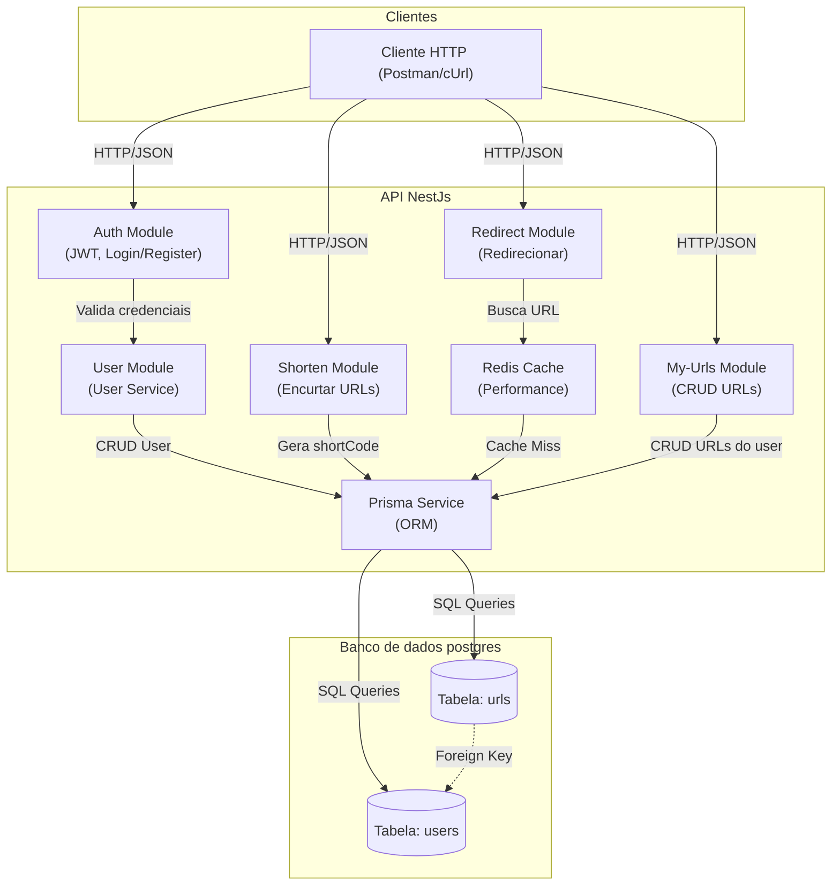
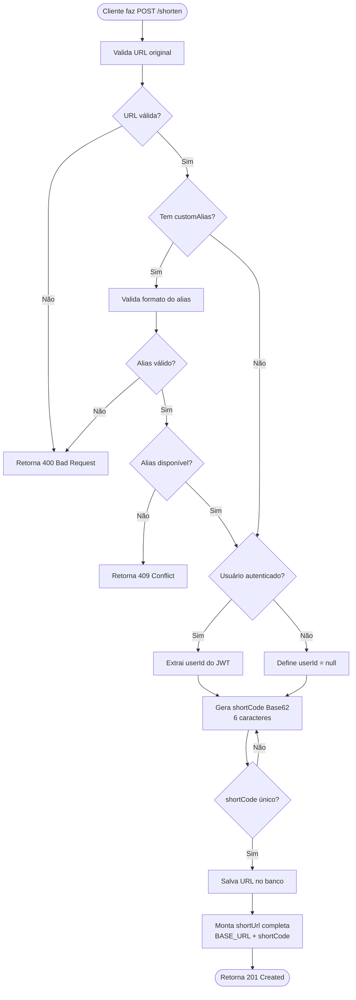
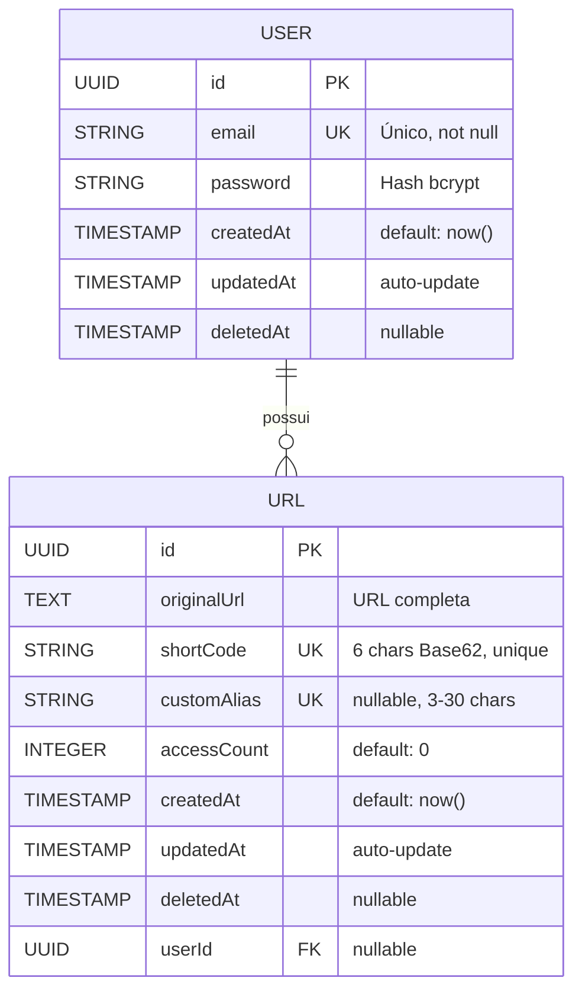
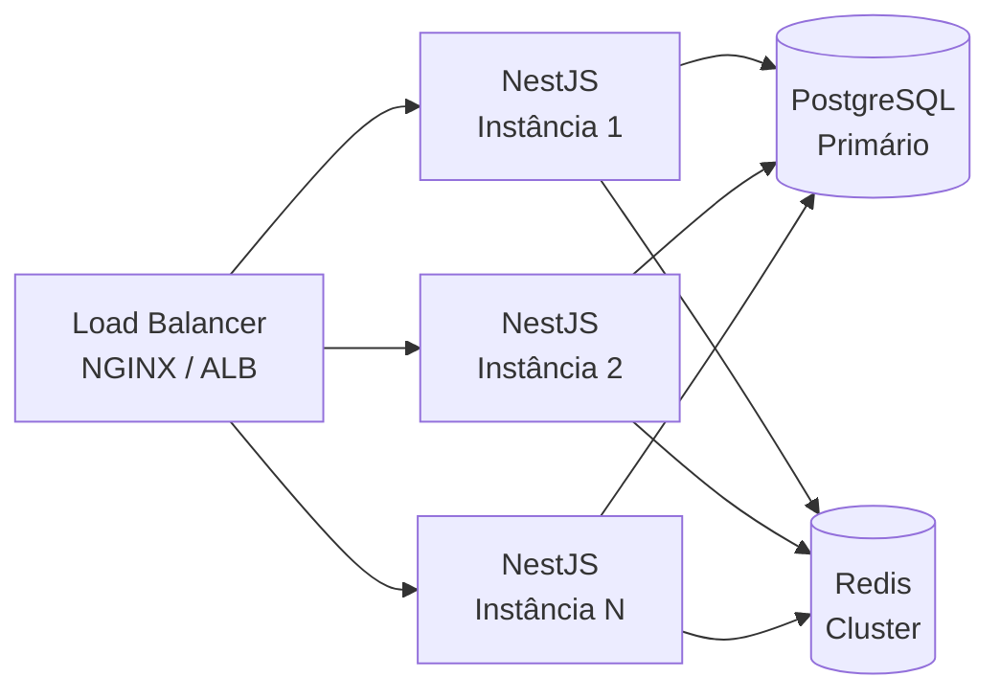
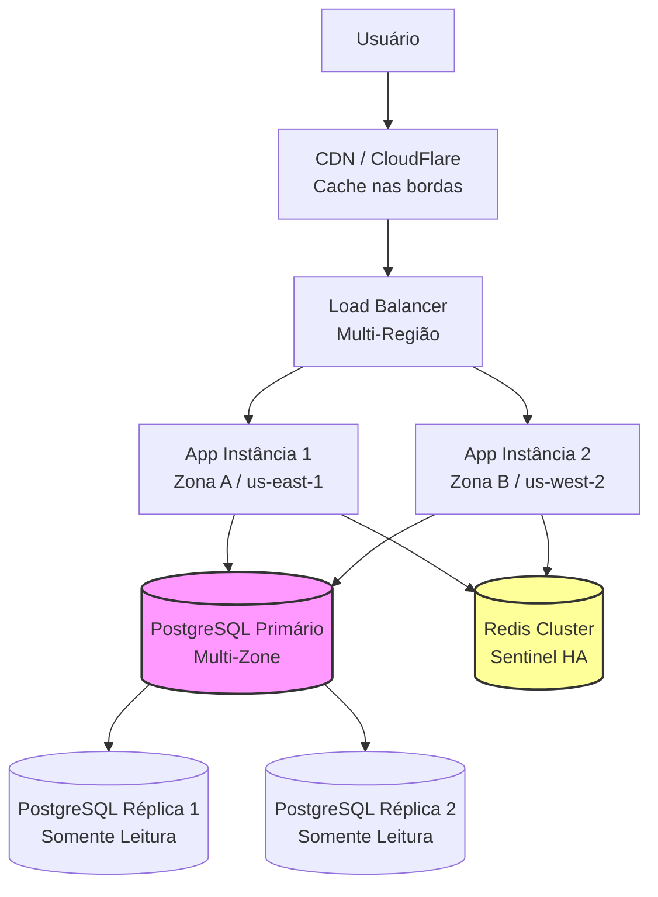

# API de Encurtamento de URLs


---

## 📝 Descrição Geral

Uma **API RESTful moderna e escalável** feita em **NestJS** para encurtamento de URLs com recursos avançados de gerenciamento e segurança.

### ✨ Principais Funcionalidades

- 🔗 **Encurtamento de URLs** - Geração automática de códigos curtos Base62 (6 caracteres)
- 🔐 **Autenticação JWT** - Sistema completo de registro e login com tokens stateless
- 🗄️ **Persistência com Prisma ORM** - PostgreSQL como banco de dados relacional
- 🎨 **Aliases Customizados** - URLs personalizadas com validação de unicidade
- 📊 **Contagem de Acessos** - Tracking automático de cada redirecionamento
- 🗑️ **Soft Delete** - Preservação de dados históricos sem remoção física
- 📚 **Documentação Swagger** - API totalmente documentada e testável via interface web
- 🐳 **Docker Compose** - Deploy local simplificado com containers
- 🧪 **Cobertura de Testes** - Testes unitários e E2E com +80% de cobertura
- ⚡ **Redis Cache** - Performance otimizada para URLs mais acessadas
- 🛡️ **Segurança** - Helmet, CORS, Rate Limiting e validações robustas

---

## 🚀 Tecnologias Utilizadas

| Tecnologia | Descrição | Versão |
|------------|-----------|---------|
| **Node.js** | Runtime JavaScript server-side | LTS (v20+) |
| **NestJS** | Framework progressivo Node.js para aplicações server-side escaláveis | ^11.x |
| **TypeScript** | Superset JavaScript com tipagem estática | ^5.x |
| **Prisma ORM** | ORM moderno para TypeScript e Node.js | ^6.x |
| **PostgreSQL** | Banco de dados relacional open-source | 15+ |
| **JWT** | JSON Web Tokens para autenticação stateless | via @nestjs/jwt |
| **Passport** | Middleware de autenticação para Node.js | via @nestjs/passport |
| **Redis** | Cache em memória para alta performance | Latest |
| **Docker & Docker Compose** | Containerização e orquestração local | Latest |
| **Jest** | Framework de testes unitários e E2E | ^29.x |
| **Swagger / OpenAPI** | Documentação interativa de APIs | via @nestjs/swagger |
| **ESLint & Prettier** | Linting e formatação de código | Latest |
| **class-validator** | Validação declarativa baseada em decorators | ^0.14.x |
| **bcrypt** | Hash seguro de senhas | ^6.x |
| **Helmet** | Headers HTTP seguros | ^8.x |

---

## 📦 Requisitos do Sistema e Regras de Negócio

### Requisitos Funcionais Principais

#### ✅ 1. Cadastro e Autenticação de Usuários
- Registro via e-mail e senha
- Login retorna token JWT com expiração configurável
- Senha hasheada com bcrypt (10 salt rounds)
- Validação de e-mail único no sistema

#### ✅ 2. Encurtamento de URLs
- Funcionalidade disponível **com ou sem autenticação**
- URLs autenticadas são associadas ao usuário (campo `userId`)
- URLs não autenticadas ficam sem dono (`userId = null`)
- Geração automática de shortCode Base62 (6 caracteres)
- Suporte a aliases customizados opcionais

#### ✅ 3. Gestão de URLs (usuários autenticados)
- Listar todas as URLs próprias com paginação
- Atualizar URL original ou customAlias
- Excluir URLs (soft delete mantém histórico)
- Visualizar estatísticas de acessos

#### ✅ 4. Redirecionamento
- Endpoint público `GET /:short` redireciona para URL original
- Incrementa contador de acessos automaticamente
- Suporte a cache Redis para URLs populares
- Retorna 404 se URL foi deletada ou não existe

#### ✅ 5. Aliases Customizados
- Usuário pode escolher alias personalizado (opcional)
- Deve ser único globalmente no sistema
- Validação: `^[a-z0-9_-]{3,30}$` (case-insensitive)
- Proteção contra colisão com rotas reservadas

#### ✅ 6. Soft Delete
- Registros não são removidos fisicamente do banco
- Campo `deletedAt` marca exclusão lógica
- URLs deletadas não são acessíveis via redirecionamento
- Preserva integridade referencial e histórico

---

### Regras de Negócio das URLs

| Regra | Descrição |
|-------|-----------|
| **Validação de URL** | Deve conter protocolo `http://` ou `https://` válido |
| **Código Curto (shortCode)** | Exatamente **6 caracteres** alfanuméricos Base62 `[A-Za-z0-9]` case-sensitive |
| **Geração de shortCode** | Algoritmo Base62 a partir de timestamp + hash único |
| **Colisão de shortCode** | Sistema regenera automaticamente até encontrar código único |
| **Aliases Customizados** | • Min: 3 caracteres<br>• Max: 30 caracteres<br>• Apenas lowercase, números, `-`, `_`<br>• Case-insensitive (armazenar lowercase)<br>• Não pode colidir com rotas reservadas (`/auth`, `/docs`, `/api`, `/my-urls`, `/healthcheck`) |
| **Contagem de Acessos** | Campo `accessCount` iniciado em 0 e incrementado a cada `GET /:short` bem-sucedido |
| **Redirecionamento** | HTTP Status **302 Found** (redirect temporário) |
| **URLs Deletadas** | Retornam **404 Not Found** ao tentar acessar |
| **Timestamps** | `createdAt`, `updatedAt`, `deletedAt` automáticos via Prisma |
| **Domínio Base** | Configurável via variável `BASE_URL` (ex: `http://localhost:3000`) |

---

### 4.3. Endpoints da API

| Método | Endpoint | Descrição | Auth |
|--------|----------|-----------|------|
| `POST` | `/auth/register` | Registra novo usuário | ❌ |
| `POST` | `/auth/login` | Autentica e retorna JWT | ❌ |
| `POST` | `/shorten` | Encurta uma URL | 🔓 Opcional |
| `GET` | `/my-urls` | Lista URLs do usuário autenticado | ✅ |
| `GET` | `/my-urls/:id` | Lista uma URL do usuário autenticado por id | ✅ |
| `PUT` | `/my-urls/:id` | Atualiza URL (originalUrl ou customAlias) | ✅ |
| `DELETE` | `/my-urls/:id` | Soft delete de URL | ✅ |
| `GET` | `/:short` | Redireciona para URL original | ❌ |
| `GET` | `/healthcheck` | Health check da aplicação | ❌ |

**Legenda:**
- ✅ = Requer token JWT no header `Authorization: Bearer <token>`
- 🔓 = Opcional (se autenticado, associa `userId`)
- ❌ = Público (sem autenticação)

---

## ⚙️ Arquitetura da Aplicação

A aplicação segue os princípios de **Clean Architecture** e **Domain-Driven Design (DDD)**, garantindo:
- 🎯 Separação clara de responsabilidades
- 🔄 Facilidade de manutenção e testes
- 📈 Escalabilidade horizontal e vertical
- 🧩 Baixo acoplamento entre módulos

### Organização de Camadas

```
graph TD
  src["src/"]
  main[/"main.ts, app.module.ts, app.controller.ts, app.service.ts"/]

  auth["auth/"]
  auth_sub["Controllers, Services, Strategies, Guards, DTOs"]

  user["user/"]
  user_sub["Services, Repositories, Entities"]

  urls["urls/"]
  urls_sub["Repositories, Entities, DTOs"]

  shorten["shorten/"]
  shorten_sub["Controllers, Services, Validators, DTOs"]

  redirect["redirect/"]
  redirect_sub["Service, Controllers"]

  my_urls["my-urls/"]
  my_urls_sub["Controllers, Services"]

  prisma["prisma/"]
  prisma_sub["PrismaModule, PrismaService"]

  common["common/"]
  common_sub["Filters, Middlewares, DTOs"]

  src --> main
  src --> auth --> auth_sub
  src --> user --> user_sub
  src --> urls --> urls_sub
  src --> shorten --> shorten_sub
  src --> redirect --> redirect_sub
  src --> my_urls --> my_urls_sub
  src --> prisma --> prisma_sub
  src --> common --> common_sub

```

### Princípios Aplicados

- ✅ **Separation of Concerns** - Cada módulo tem responsabilidade única bem definida
- ✅ **Dependency Injection** - NestJS IoC Container gerencia todas as dependências
- ✅ **Repository Pattern** - Abstração completa do acesso a dados
- ✅ **DTO Pattern** - Validação e transformação de dados de entrada/saída
- ✅ **Strategy Pattern** - Passport JWT Strategy para autenticação extensível
- ✅ **Guard Pattern** - Proteção declarativa de rotas autenticadas
- ✅ **Exception Filters** - Tratamento centralizado e padronizado de erros
- ✅ **SOLID Principles** - Código limpo, testável e manutenível

---

## 🧱 Diagrama de Arquitetura



---

## 🔗 Diagrama de Fluxo do Encurtamento



---

## 🧮 Modelo Entidade-Relacionamento



**Constraints e Índices:**
- `email` → UNIQUE, NOT NULL, VARCHAR(255)
- `shortCode` → UNIQUE, NOT NULL, LENGTH = 6, INDEX
- `customAlias` → UNIQUE (quando não nulo), VARCHAR(30), INDEX
- `userId` → FK para `users.id`, ON DELETE SET NULL, INDEX

---

## 🧰 Instalação e Execução

### 9.1. Pré-requisitos

Certifique-se de ter instalado:

- **Node.js** v20+ LTS ([Download](https://nodejs.org/))
- **Docker** e **Docker Compose** ([Download](https://www.docker.com/))
- **pnpm** (recomendado) ou **npm**
- **Git**

```bash
# Instalar pnpm globalmente
npm install -g pnpm
```

---

### 9.2. Passo a Passo

#### **1️⃣ Clone o repositório**

```bash
git clone https://github.com/gabrigabs/node-url-shortener.git
cd node-url-shortener
```

#### **2️⃣ Instale as dependências**

```bash
# Usando pnpm (recomendado)
pnpm install

# Ou usando npm
npm install
```

#### **3️⃣ Configure as variáveis de ambiente**

```bash
cp .env.example .env
```

Edite o arquivo `.env` conforme necessário:

```env
# Application
NODE_ENV=development
PORT=3000

# Database
DATABASE_HOST=db
DATABASE_PORT=5432
DATABASE_USER=url_user
DATABASE_PASSWORD=url_pass
DATABASE_NAME=url_shortener
DATABASE_URL="postgresql://url_user:url_pass@db:5432/url_shortener?schema=public"

# JWT
JWT_SECRET=chave-jwt-super-segura-mude-em-producao
JWT_EXPIRES_IN=3600000

# Base URL para URLs encurtadas
BASE_URL=http://localhost:3000

# Redis
REDIS_HOST=redis
REDIS_PORT=6379
```

⚠️ **IMPORTANTE:** Altere `JWT_SECRET` para produção com uma chave forte!

#### **4️⃣ Suba os containers Docker**
##### Para ambiente de desenvolvimento
```bash
docker-compose --profile dev up
```
##### Para ambiente de produção
```bash
docker-compose --profile prod up
```

Isso iniciará:
- 🐘 **PostgreSQL** na porta `5432`
- 🔴 **Redis** na porta `6379`
- 🚀 **Aplicação NestJS** na porta `3000`

Verifique se os containers estão rodando:

```bash
docker-compose ps
```

#### **5️⃣ Execute as migrations do Prisma**

```bash
# Gerar cliente Prisma
pnpm prisma:generate

# Executar migrations
pnpm prisma:migrate
```

#### **6️⃣ (Opcional) Visualize o banco de dados**

```bash
pnpm prisma:studio
```

Abre interface web em **http://localhost:5555**

#### **7️⃣ Inicie a aplicação**

A aplicação já está rodando via Docker, mas você pode rodá-la localmente:

```bash
# Desenvolvimento com hot-reload
pnpm start:dev

# Ou em modo produção
pnpm build
pnpm start:prod
```

#### **8️⃣ Acesse a aplicação**

- 🌐 **API:** [http://localhost:3000](http://localhost:3000)
- 📚 **Swagger Docs:** [http://localhost:3000/docs](http://localhost:3000/docs)
- 🗄️ **Prisma Studio:** [http://localhost:5555](http://localhost:5555)
- ❤️ **Health Check:** [http://localhost:3000/healthcheck](http://localhost:3000/healthcheck)

---

## 🚦 Testes

### 10.1. Testes Unitários

Localizados em `/tests/unit/`, organizados por módulo com mocks do Prisma:

```bash
# Rodar todos os testes unitários
pnpm test

# Modo watch (desenvolvimento)
pnpm test:watch

# Com cobertura de código
pnpm test:cov
```

**Cobertura mínima exigida:** 80% (branches, functions, lines, statements)

### 10.2. Testes E2E (End-to-End)

Localizados em `/tests/e2e/`, testam fluxos completos da aplicação:

```bash
# Rodar testes E2E
pnpm test:e2e

# Com cobertura
pnpm test:e2e:cov

# Modo watch
pnpm test:e2e:watch
```

### 10.3. Estrutura de Testes

```
tests/
├── unit/                         # Testes unitários isolados
│   ├── auth/
│   │   ├── auth.service.spec.ts
│   │   └── jwt.strategy.spec.ts
│   ├── user/
│   │   └── user.service.spec.ts
│   ├── url/
│   │   └── url.repository.spec.ts
│   ├── shorten/
│   │   └── shorten.service.spec.ts
│   ├── redirect/
│   │   └── redirect.service.spec.ts
│   ├── my-urls/
│   │   └── my-urls.service.spec.ts
│   ├── common/
│   │   └── filters.spec.ts
│   └── __mocks__/
│       └── prisma.service.mock.ts
│
├── e2e/                          # Testes end-to-end
│   ├── auth/
│   │   └── auth.e2e-spec.ts
│   ├── url/
│   │   └── url.e2e-spec.ts
│   ├── my-urls/
│   │   └── my-urls.e2e-spec.ts
│   ├── user/
│   │   └── user.e2e-spec.ts
│   └── setup/
│       └── test-helpers.ts
│
└── jest-setup.ts                 # Configuração global do Jest
```

### 10.4. Cobertura de Testes

Os testes cobrem:
- ✅ Autenticação (registro, login, validação JWT)
- ✅ Encurtamento de URLs (com e sem autenticação)
- ✅ Validação de aliases customizados
- ✅ Redirecionamento e contagem de acessos
- ✅ CRUD de URLs autenticadas
- ✅ Soft delete e queries com deletedAt
- ✅ Tratamento de erros e edge cases

---

## 📘 Documentação da API (Swagger)

Após iniciar a aplicação, acesse a documentação interativa:

🔗 **[http://localhost:3000/docs](http://localhost:3000/docs)**

### Recursos da Documentação:

- ✅ **Todos os endpoints** com descrições detalhadas
- ✅ **Schemas de request/response** com validações
- ✅ **Exemplos de payloads** prontos para usar
- ✅ **Autenticação JWT** via botão "Authorize"
- ✅ **Testagem interativa** direto pelo navegador
- ✅ **Códigos de status HTTP** documentados
- ✅ **Modelos de dados** com tipos TypeScript

### Como testar via Swagger:

1. Acesse http://localhost:3000/docs
2. Registre um usuário em `POST /auth/register`
3. Faça login em `POST /auth/login` e copie o token
4. Clique em "Authorize" e cole o token: `Bearer <seu-token>`
5. Teste os endpoints protegidos!

---

## 🌐 Variáveis de Ambiente

| Variável | Descrição | Valor Padrão |
|----------|-----------|--------------|-------------|
| `NODE_ENV` | Ambiente de execução | `development` |
| `PORT` | Porta da aplicação | `3000` |
| `DATABASE_HOST` | Host do PostgreSQL | `localhost` |
| `DATABASE_PORT` | Porta do PostgreSQL | `5432` |
| `DATABASE_USER` | Usuário do banco | - |
| `DATABASE_PASSWORD` | Senha do banco | - |
| `DATABASE_NAME` | Nome do banco | - |
| `DATABASE_URL` | String de conexão PostgreSQL completa | - | 
| `JWT_SECRET` | Chave secreta para tokens JWT | - |
| `JWT_EXPIRES_IN` | Tempo de expiração do token (ms) | `3600000` (1h) | 
| `BASE_URL` | Domínio base para URLs encurtadas | `http://localhost:3000` |
| `REDIS_HOST` | Host do Redis | `localhost` |
| `REDIS_PORT` | Porta do Redis | `6379` |

### Exemplo completo de `.env`:

```env
NODE_ENV=development
PORT=3000
DATABASE_HOST=db
DATABASE_PORT=5432
DATABASE_USER=url_user
DATABASE_PASSWORD=url_pass
DATABASE_NAME=url_shortener
DATABASE_URL="postgresql://url_user:url_pass@db:5432/url_shortener?schema=public"
JWT_SECRET=chave-jwt-super-segura-mude-em-producao
JWT_EXPIRES_IN=3600000
BASE_URL=http://localhost:3000
REDIS_HOST=redis
REDIS_PORT=6379
```

---

## 🧪 Critérios de Qualidade do Projeto

Este projeto segue **rigorosos padrões de qualidade de software** para garantir código profissional, manutenível e escalável.

### Qualidade de Código

- ✅ **TypeScript Strict Mode** ativo para máxima segurança de tipos
- ✅ **ESLint** configurado com regras recomendadas NestJS
- ✅ **Prettier** para formatação consistente do código
- ✅ **Commits Convencionais** seguindo padrão Conventional Commits
- ✅ **Code Review** obrigatório em PRs
- ✅ **Zero warnings** no build de produção

### Testes

- ✅ **Cobertura ≥ 80%** em testes unitários
- ✅ **Testes E2E** cobrindo todos os fluxos principais:
  - Autenticação (registro e login com validações)
  - Encurtamento de URLs (com e sem autenticação)
  - Redirecionamento e contagem de acessos
  - CRUD completo de URLs autenticadas
  - Validações de aliases customizados e colisões
  - Soft delete e queries com timestamps
- ✅ **Testes de integração** com banco de dados real
- ✅ **Mocks** do Prisma para testes unitários isolados

### Documentação

- ✅ **Swagger/OpenAPI** completo e atualizado automaticamente
- ✅ **README.md** detalhado com diagramas e exemplos
- ✅ **Comentários JSDoc** em funções complexas
- ✅ **Diagramas Mermaid** para arquitetura e fluxos
- ✅ **Documentação inline** no código quando necessário

### DevOps e CI/CD

- ✅ **Docker Compose** para ambiente local reproduzível
- ✅ **Prisma Migrations** versionadas e testadas
- ✅ **Health Check** endpoint para monitoramento
- ✅ **Logs estruturados** com Winston
- ✅ **Gitub Actions** para validação de workflows

### Segurança

- ✅ **Senhas hasheadas** com bcrypt (10 salt rounds)
- ✅ **JWT stateless** com expiração configurável
- ✅ **Validação de entrada** rigorosa com class-validator
- ✅ **Rate Limiting** com @nestjs/throttler
- ✅ **CORS** configurado adequadamente
- ✅ **Helmet** para headers HTTP seguros
- ✅ **SQL Injection** prevenido via Prisma ORM
- ✅ **XSS Protection** via validação de entrada

### Performance

- ✅ **Redis Cache** para URLs mais acessadas
- ✅ **Índices de banco** em campos frequentemente consultados
- ✅ **Connection Pooling** do Prisma otimizado
- ✅ **Lazy Loading** de módulos quando aplicável
- ✅ **Compressão** de respostas HTTP

---

## ☁️ Escalabilidade da Solução

A aplicação foi cuidadosamente planejada para garantir alta disponibilidade, desempenho otimizado e capacidade de expansão face a variações de carga e crescimento da base de usuários.

### Estratégias de Escalabilidade

#### **Escalabilidade Horizontal**
A aplicação segue o princípio de uma arquitetura stateless, o que possibilita aumentar a capacidade de processamento adicionando múltiplas instâncias da API sem a necessidade de compartilhamento de estado entre elas. Dentre as estrategias que podem ser adotadas podemos citar:

**Stateless API com JWT:** Ao utilizar tokens JWT para autenticação, eliminamos a necessidade de manter sessões ou estados compartilhados no servidor, facilitando a replicação horizontal.

**Load Balancer:** Um balanceador de carga (exemplo: NGINX) distribui as requisições entre as instâncias de forma eficiente para garantir distribuição justa e failover automático.

**Orquestração com Kubernetes:** Possibilita deploy automático de várias réplicas da API, com escalonamento dinâmico baseado em métricas (Horizontal Pod Autoscaler - HPA).

**Cache Distribuído com Redis:** Implementação de cluster Redis para cache compartilhado entre as instâncias, reduzindo latência e carga no banco.



#### **Escalabilidade Vertical**

Além do aumento horizontal, a aplicação está otimizada para extrair máximo desempenho em uma única instância podendo ser feitas diversas técnicas, como:

**PostgreSQL Otimizado**: Ajustes finos nos parâmetros como shared_buffers e work_mem para otimização de memória e I/O.

**Connection Pooling com Prisma:** Limita e gerencia conexões simultâneas ao banco, evitando sobrecarga e aprimorando eficiência.

**Node.js Cluster Mode:** Uso dos múltiplos núcleos da CPU, aumentando throughput da aplicação em execução mono-instância.

**Otimização de Memória no Redis:** Aplicação de políticas inteligentes de eviction para manutenção do cache eficiente e contínuo.


#### **Alta Disponibilidade**
Infraestrutura projetada para garantir resiliência e continuidade com múltiplas zonas geográficas:





### Padrão de Commits

Este projeto segue **[Conventional Commits](https://www.conventionalcommits.org/)**:

```
feat: adiciona nova funcionalidade
fix: corrige bug específico
docs: atualiza documentação
test: adiciona ou corrige testes
refactor: refatora código sem mudar comportamento
perf: melhora performance
style: formatação, ponto e vírgula, etc
chore: atualiza dependências ou configurações
ci: mudanças em CI/CD
```

### Checklist antes do PR:

- [ ] Código segue o style guide (ESLint + Prettier)
- [ ] Testes unitários passando (`pnpm test`)
- [ ] Testes E2E passando (`pnpm test:e2e`)
- [ ] Cobertura de testes ≥ 80%
- [ ] Documentação atualizada (se aplicável)
- [ ] Commit messages seguem Conventional Commits


## 👨‍💻 Autor

**Gabriel Bezerra Rodrigues**  
Desenvolvedor

- 🐙 **GitHub:** [@gabrigabs](https://github.com/gabrigabs)
- 💼 **LinkedIn:** [linkedin.com/in/gabriel-bezerra-rod](https://linkedin.com/in/gabriel-bezerra-rod)


